<br>


\
\

```r
library(tm)
```

```
## Warning: package 'tm' was built under R version 4.1.2
```

```
## Loading required package: NLP
```

```r
library(wordcloud)
```

```
## Warning: package 'wordcloud' was built under R version 4.1.2
```

```
## Loading required package: RColorBrewer
```

```r
library(syuzhet)
```

```
## Warning: package 'syuzhet' was built under R version 4.1.2
```

```r
library(ggplot2)
```

```
## Warning: package 'ggplot2' was built under R version 4.1.1
```

```
## 
## Attaching package: 'ggplot2'
```

```
## The following object is masked from 'package:NLP':
## 
##     annotate
```

```r
library(dplyr)
```

```
## 
## Attaching package: 'dplyr'
```

```
## The following objects are masked from 'package:stats':
## 
##     filter, lag
```

```
## The following objects are masked from 'package:base':
## 
##     intersect, setdiff, setequal, union
```

```r
library(tidytext)
```

```
## Warning: package 'tidytext' was built under R version 4.1.2
```


```r
testdata = read.csv('vaccination_all_tweets.csv', nrows = 5000)
head(testdata,10)
```

```
##              id               user_name               user_location
## 1  1.340539e+18              Rachel Roh   La Crescenta-Montrose, CA
## 2  1.338159e+18             Albert Fong           San Francisco, CA
## 3  1.337858e+18 eli🇱🇹🇪🇺👌                    Your Bed
## 4  1.337856e+18           Charles Adler      Vancouver, BC - Canada
## 5  1.337854e+18    Citizen News Channel                            
## 6  1.337853e+18                     Dee         Birmingham, England
## 7  1.337851e+18       Gunther Fehlinger Austria, Ukraine and Kosovo
## 8  1.337851e+18     Dr.Krutika Kuppalli                            
## 9  1.337850e+18             Erin Despas                            
## 10 1.337842e+18            Ch.Amjad Ali                   Islamabad
##                                                                                                                                                    user_description
## 1                                          Aggregator of Asian American news; scanning diverse sources 24/7/365. RT's, Follows and 'Likes' will fuel me 👩â\200\215💻
## 2                           Marketing dude, tech geek, heavy metal & '80s music junkie. Fascinated by meteorology and all things in the cloud. Opinions are my own.
## 3                                                                                                                                               heil, hydra ðŸ–\220â\230º
## 4                 Hosting "CharlesAdlerTonight" Global News Radio Network. Weeknights 7 Pacific-10 Eastern - Email comments/ideas to charles@charlesadlertonight.ca
## 5                               Citizen News Channel bringing you an alternative news source from citizen journalists that haven't sold out. Real news & real views
## 6                                                      Gastroenterology trainee, Clinical Research Fellow in IBD, mother to human and fur baby, Canadian in Britain
## 7  End North Stream 2 now - the pipeline of corruption, funding Russias war against Ukraine,Georgia, Syria and political intervention in USA and EU must be stopped
## 8                  ID, Global Health, VHF, Pandemic Prep, Emerging Infections, & Health Policy MD| U.S. Congress COVID-19 expert witness x 2 | ELBI 2020 @JHSPH_CHS
## 9                  Designing&selling on Teespring. Like 90s Disney tv movies, old school WWE. Dislikes Intolerance, hate, bigots and snakes https://t.co/fa5n4gEHgR
## 10                                      #ProudPakistani #LovePakArmy #PMIK @insafianspower1\n#PoliticalScience #InternationalAffairs \n#PAKUSTV #Newyork #Islamabad
##           user_created user_followers user_friends user_favourites
## 1  2009-04-08 17:52:46            405         1692            3247
## 2  2009-09-21 15:27:30            834          666             178
## 3  2020-06-25 23:30:28             10           88             155
## 4  2008-09-10 11:28:53          49165         3933           21853
## 5  2020-04-23 17:58:42            152          580            1473
## 6  2020-01-26 21:43:12            105          108             106
## 7  2013-06-10 17:49:22           2731         5001           69344
## 8  2019-03-25 04:14:29          21924          593            7815
## 9  2009-10-30 17:53:54            887         1515            9639
## 10 2012-11-12 04:18:12            671         2368           20469
##    user_verified                date
## 1          False 2020-12-20 06:06:44
## 2          False 2020-12-13 16:27:13
## 3          False 2020-12-12 20:33:45
## 4           True 2020-12-12 20:23:59
## 5          False 2020-12-12 20:17:19
## 6          False 2020-12-12 20:11:42
## 7          False 2020-12-12 20:06:00
## 8           True 2020-12-12 20:04:29
## 9          False 2020-12-12 20:01:16
## 10         False 2020-12-12 19:30:33
##                                                                                                                                                text
## 1                                                 Same folks said daikon paste could treat a cytokine storm #PfizerBioNTech https://t.co/xeHhIMg1kF
## 2    While the world has been on the wrong side of history this year, hopefully, the biggest vaccination effort we've evâ\200¦ https://t.co/dlCHrZjkhm
## 3    #coronavirus #SputnikV #AstraZeneca #PfizerBioNTech #Moderna #Covid_19 Russian vaccine is created to last 2-4 yearsâ\200¦ https://t.co/ieYlCKBr8P
## 4    Facts are immutable, Senator, even when you're not ethically sturdy enough to acknowledge them. (1) You were born iâ\200¦ https://t.co/jqgV18kch4
## 5         Explain to me again why we need a vaccine @BorisJohnson @MattHancock #whereareallthesickpeople #PfizerBioNTechâ\200¦ https://t.co/KxbSRoBEHq
## 6                Does anyone have any useful advice/guidance for whether the COVID vaccine is safe whilst breastfeeding?â\200¦ https://t.co/EifsyQoeKN
## 7     it is a bit sad to claim the fame for success of #vaccination on patriotic competition between USA, Canada, UK andâ\200¦ https://t.co/IfMrAyGyTP
## 8     There have not been many bright days in 2020 but here are some of the best \n1. #BidenHarris winning #Election2020â\200¦ https://t.co/77u4f8XXfx
## 9                                                                Covid vaccine; You getting it?\n\n #CovidVaccine #covid19 #PfizerBioNTech #Moderna
## 10 #CovidVaccine \n\nStates will start getting #COVID19Vaccine Monday, #US says \n#pakustv #NYC #Healthcare #GlobalGoalsâ\200¦ https://t.co/MksOvBvs5w
##                                                                                   hashtags
## 1                                                                       ['PfizerBioNTech']
## 2                                                                                         
## 3      ['coronavirus', 'SputnikV', 'AstraZeneca', 'PfizerBioNTech', 'Moderna', 'Covid_19']
## 4                                                                                         
## 5                                           ['whereareallthesickpeople', 'PfizerBioNTech']
## 6                                                                                         
## 7                                                                          ['vaccination']
## 8                                                          ['BidenHarris', 'Election2020']
## 9                                 ['CovidVaccine', 'covid19', 'PfizerBioNTech', 'Moderna']
## 10 ['CovidVaccine', 'COVID19Vaccine', 'US', 'pakustv', 'NYC', 'Healthcare', 'GlobalGoals']
##                 source retweets favorites is_retweet
## 1  Twitter for Android        0         0      False
## 2      Twitter Web App        1         1      False
## 3  Twitter for Android        0         0      False
## 4      Twitter Web App      446      2129      False
## 5   Twitter for iPhone        0         0      False
## 6   Twitter for iPhone        0         0      False
## 7      Twitter Web App        0         4      False
## 8   Twitter for iPhone        2        22      False
## 9      Twitter Web App        2         1      False
## 10     Twitter Web App        0         0      False
```


```r
#convert all text to lower case
testdata$text <- iconv(testdata$text,"WINDOWS-1252","UTF-8")
testdata_text <- tolower(testdata$text)


# Replace blank space 
testdata_text <- gsub("rt", "", testdata_text)

# Replace @UserName
testdata_text <- gsub("@\\w+", "", testdata_text)

# Remove punctuation
testdata_text <- gsub("[[:punct:]]", "", testdata_text)

# Remove links
testdata_text <- gsub("http\\w+", "", testdata_text)

# Remove tabs
testdata_text <- gsub("[ |\t]{2,}", "", testdata_text)

# Remove blank spaces at the beginning
testdata_text <- gsub("^ ", "", testdata_text)

# Remove blank spaces at the end
testdata_text <- gsub(" $", "", testdata_text)
```


```r
head(testdata_text)
```

```
## [1] "same folks said daikon paste could treat a cytokine storm pfizerbiontech"                                        
## [2] "while the world has been on the wrong side of history this year hopefully the biggest vaccination effo weve evâ\200"
## [3] "coronavirus sputnikv astrazeneca pfizerbiontech moderna covid19 russian vaccine is created to last 24 yearsâ\200"   
## [4] "facts are immutable senator even when youre not ethically sturdy enough to acknowledge them 1 you were born iâ\200" 
## [5] "explain to me again why we need a vaccinewhereareallthesickpeople pfizerbiontechâ\200"                              
## [6] "does anyone have any useful adviceguidance for whether the covid vaccine is safe whilst breastfeedingâ\200"
```


```r
datetime = testdata$date
head(datetime)
```

```
## [1] "2020-12-20 06:06:44" "2020-12-13 16:27:13" "2020-12-12 20:33:45"
## [4] "2020-12-12 20:23:59" "2020-12-12 20:17:19" "2020-12-12 20:11:42"
```


```r
date = data.frame(table(as.Date(datetime)))
names(date) = c("Date", "Frequency")
date <- date[1:32,]
ggplot(data=date,aes(x=Date,y=Frequency))+geom_bar(aes(fill='red'),stat = "identity") + theme(axis.text.x = element_text(angle = 90, vjust = 0.5, hjust=1))
```

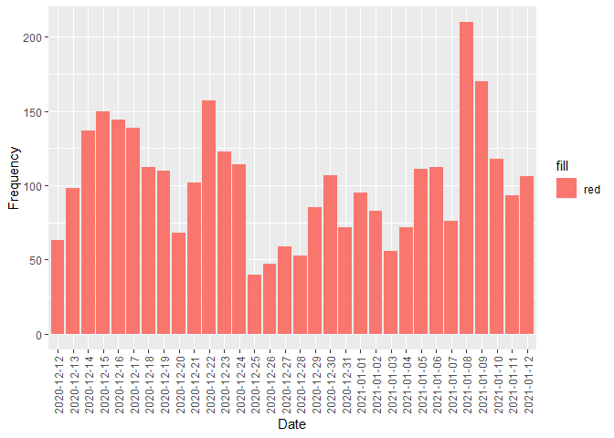<!-- -->


```r
hashtag_tokens <- get_tokens(testdata$hashtags)
hashtag <- data.frame(table(hashtag_tokens))
names(hashtag) <- c('Hashtag', 'Frequency')

hashtag_sorted <- hashtag[order(hashtag$Frequency, decreasing = TRUE),]

hashtag_sorted <- head(hashtag_sorted, 8)
hashtag_sorted
```

```
##             Hashtag Frequency
## 989  pfizerbiontech      2594
## 283         covid19       724
## 1417        vaccine       503
## 333    covidvaccine       415
## 987          pfizer       280
## 995   pfizervaccine       218
## 257     coronavirus       181
## 821         moderna       175
```


```r
ggplot(data=hashtag_sorted, aes(x=Hashtag, y=Frequency))+geom_bar(aes(fill=Hashtag), stat='identity')+theme(axis.text.x = element_text(angle = 90, vjust = 0.5, hjust=1))
```

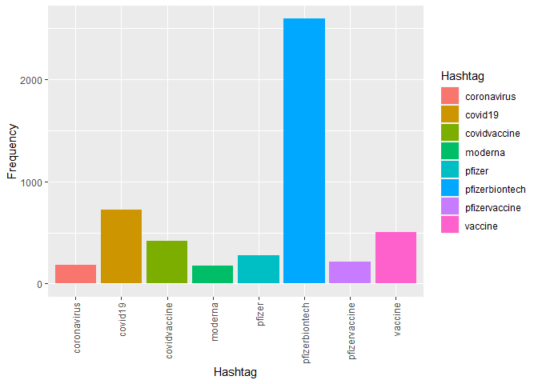<!-- -->


```r
testdata_text_corpus <- Corpus(VectorSource(testdata_text))
testdata_text_corpus <- tm_map(testdata_text_corpus, function(x)removeWords(x,stopwords()))
```

```
## Warning in tm_map.SimpleCorpus(testdata_text_corpus, function(x)
## removeWords(x, : transformation drops documents
```


```r
wordcloud(testdata_text_corpus,min.freq = 20,colors=brewer.pal(8, "Dark2"),random.color = TRUE,max.words = 100, scale = c(3,.5))
```

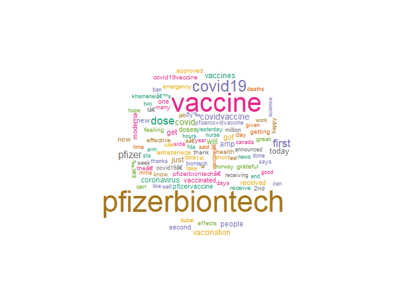<!-- -->


```r
#sentiment analysis
testdata_text_sent<-get_nrc_sentiment((testdata_text))

#calculationg total score for each sentiment
testdata_text_sent_score<-data.frame(colSums(testdata_text_sent[,]))

names(testdata_text_sent_score)<-"Score"
testdata_text_sent_score<-cbind("sentiment"=rownames(testdata_text_sent_score),testdata_text_sent_score)
rownames(testdata_text_sent_score)<-NULL

testdata_text_sent_score
```

```
##       sentiment Score
## 1         anger   798
## 2  anticipation  1534
## 3       disgust   527
## 4          fear  1229
## 5           joy  1124
## 6       sadness   991
## 7      surprise   926
## 8         trust  1838
## 9      negative  1754
## 10     positive  5327
```


```r
#plotting the sentiments with scores
ggplot(data=testdata_text_sent_score,aes(x=sentiment,y=Score))+geom_bar(aes(fill=sentiment),stat = "identity")+
  theme(legend.position="none")+
  xlab("Sentiments")+ylab("scores")+ggtitle("Sentiments of people ")
```

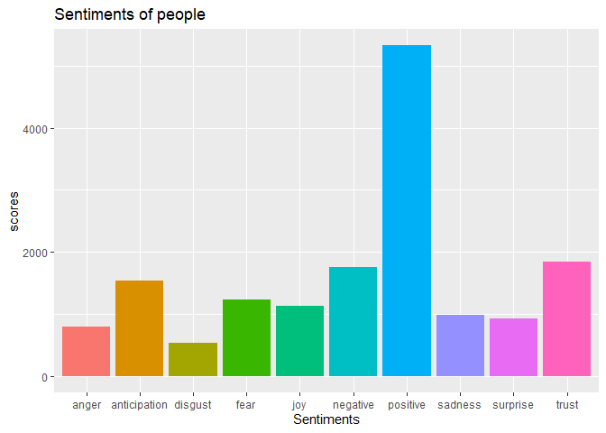<!-- -->


```r
tokens = get_sentences(testdata_text)
sent = get_sentiment(tokens, method = "afinn")
head(sent)
```

```
## [1] 0 0 0 0 0 3
```


```r
(table(sent))
```

```
## sent
##   -9   -8   -7   -6   -5   -4   -3   -2   -1    0    1    2    3    4    5    6 
##    2    3    7   19   29   95  163  388  313 2237  341  664  344  135  125   63 
##    7    8    9   10   11 
##   36   18    8    8    2
```


```r
numeric_sentiment = data.frame(table(sent))
names(numeric_sentiment) = c("Score","Frequency")
numeric_sentiment
```

```
##    Score Frequency
## 1     -9         2
## 2     -8         3
## 3     -7         7
## 4     -6        19
## 5     -5        29
## 6     -4        95
## 7     -3       163
## 8     -2       388
## 9     -1       313
## 10     0      2237
## 11     1       341
## 12     2       664
## 13     3       344
## 14     4       135
## 15     5       125
## 16     6        63
## 17     7        36
## 18     8        18
## 19     9         8
## 20    10         8
## 21    11         2
```


```r
ggplot(data=numeric_sentiment,aes(x=Score,y=Frequency))+geom_bar(aes(fill=rainbow(nrow(numeric_sentiment))), stat='identity')+
  theme(legend.position="none")+
  xlab("Sentiments")+ylab("scores")+ggtitle("Sentiments Score ")
```

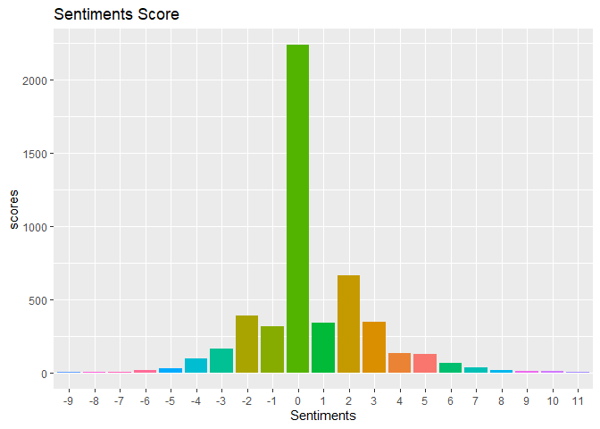<!-- -->


```r
neg <- numeric_sentiment[1:9,]
neg <- sum(neg$Frequency)
neg
```

```
## [1] 1019
```

```r
neu <- numeric_sentiment[10,]
neu <- sum(neu$Frequency)
neu
```

```
## [1] 2237
```

```r
pos <- numeric_sentiment[11:21,]
pos <- sum(pos$Frequency)
pos
```

```
## [1] 1744
```


```r
sentiment_class = data.frame(
  'Class'= c('Negative', 'Neutral', 'Positive'), 
  'Frequency'= c(neg,neu,pos))

head(sentiment_class)
```

```
##      Class Frequency
## 1 Negative      1019
## 2  Neutral      2237
## 3 Positive      1744
```


```r
ggplot(data=sentiment_class,aes(x=Class,y=Frequency))+geom_bar(aes(fill=rainbow(nrow(sentiment_class))), stat='identity')+
  theme(legend.position="none")+ggtitle("Sentiment Class")
```

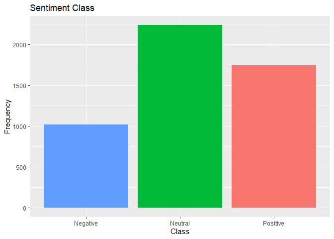<!-- -->

\


```r
verified_count <- as.data.frame(table(testdata$user_verified))
verified_count
```

```
##    Var1 Freq
## 1 False 4496
## 2  True  504
```


```r
ggplot(data=verified_count,aes(x=Var1,y=Freq))+geom_bar(aes(fill=rainbow(2)), stat='identity')+
  theme(legend.position="none")+ggtitle("Total Count of Verified and Unverified Users") + xlab('Verified')
```

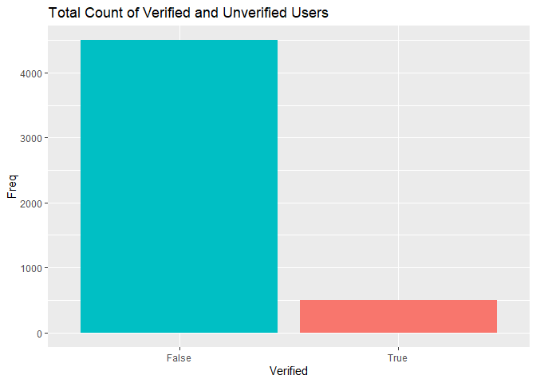<!-- -->


## Verified Users


```r
verified_tweets <- testdata[testdata$user_verified == 'True', c('user_verified','text')]
head(verified_tweets)
```

```
##    user_verified
## 4           True
## 8           True
## 13          True
## 14          True
## 16          True
## 18          True
##                                                                                                                                              text
## 4  Facts are immutable, Senator, even when you're not ethically sturdy enough to acknowledge them. (1) You were born iâ\200¦ https://t.co/jqgV18kch4
## 8   There have not been many bright days in 2020 but here are some of the best \n1. #BidenHarris winning #Election2020â\200¦ https://t.co/77u4f8XXfx
## 13 The agency also released new information for health care providers and for patients as the US shipped millions of dâ\200¦ https://t.co/sG6BtD7jD9
## 14             For all the women and healthcare providers who have been asking about the safety of the #PfizerBioNTechâ\200¦ https://t.co/ow0Pglkwte
## 16          Trump announces #vaccine rollout 'in less than 24 hours'\n\nThe first Americans will be vaccinated againstâ\200¦ https://t.co/2FzQSMnhoY
## 18       Coronavirus: Iran reports 8,201 new cases, 221 deaths in the last 24 hours #Iran #coronavirus #PfizerBioNTechâ\200¦ https://t.co/mwDNAdmb7F
```


```r
verified_sentiment = get_nrc_sentiment(verified_tweets$text)

verified_sentiment_score<-data.frame(colSums(verified_sentiment[,]))
names(verified_sentiment_score)<-"Score"
verified_sentiment_score<-cbind("sentiment"=rownames(verified_sentiment_score),verified_sentiment_score)
rownames(verified_sentiment_score)<-NULL

verified_sentiment_score
```

```
##       sentiment Score
## 1         anger    76
## 2  anticipation   184
## 3       disgust    54
## 4          fear   131
## 5           joy    88
## 6       sadness   102
## 7      surprise   106
## 8         trust   217
## 9      negative   164
## 10     positive   617
```


```r
#plotting the sentiments with scores
ggplot(data=verified_sentiment_score,aes(x=sentiment,y=Score))+geom_bar(aes(fill=sentiment),stat = "identity")+
  theme(legend.position="none")+
  xlab("Sentiments")+ylab("scores")+ggtitle("Sentiments of Verified Users ")
```

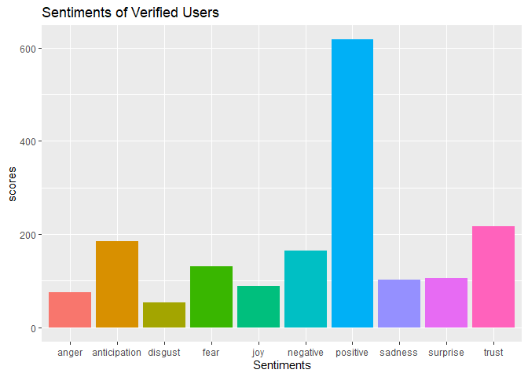<!-- -->


```r
verified_tokens = get_sentences(verified_tweets$text)
verified_sent = get_sentiment(verified_tokens, method = "afinn")
head(verified_sent)
```

```
## [1] 0 0 4 4 2 1
```


```r
(table(sent))
```

```
## sent
##   -9   -8   -7   -6   -5   -4   -3   -2   -1    0    1    2    3    4    5    6 
##    2    3    7   19   29   95  163  388  313 2237  341  664  344  135  125   63 
##    7    8    9   10   11 
##   36   18    8    8    2
```


```r
verified_numeric_sentiment = data.frame(table(verified_sent))
names(verified_numeric_sentiment) = c("Score","Frequency")
verified_numeric_sentiment
```

```
##    Score Frequency
## 1     -8         1
## 2     -7         1
## 3     -6         2
## 4     -4         8
## 5     -3        12
## 6     -2        39
## 7     -1        41
## 8      0       366
## 9      1        59
## 10     2        65
## 11     3        26
## 12     4         9
## 13     5         3
## 14     6         2
## 15     7         1
```


```r
ggplot(data=verified_numeric_sentiment,aes(x=Score,y=Frequency))+geom_bar(aes(fill=rainbow(nrow(verified_numeric_sentiment))), stat='identity')+
  theme(legend.position="none")+
  xlab("Sentiments")+ylab("scores")+ggtitle("Sentiments Score Of Verified Users ")
```

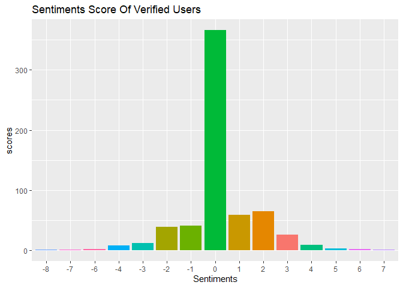<!-- -->


```r
verified_neg <- verified_numeric_sentiment[1:7,]
verified_neg <- sum(verified_neg$Frequency)
verified_neg
```

```
## [1] 104
```

```r
verified_neu <- verified_numeric_sentiment[8,]
verified_neu <- sum(verified_neu$Frequency)
verified_neu
```

```
## [1] 366
```

```r
verified_pos <- verified_numeric_sentiment[9:15,]
verified_pos <- sum(verified_pos$Frequency)
verified_pos
```

```
## [1] 165
```


```r
verified_sentiment_class = data.frame(
  'Class'= c('Negative', 'Neutral', 'Positive'), 
  'Frequency'= c(verified_neg,verified_neu,verified_pos))

head(verified_sentiment_class)
```

```
##      Class Frequency
## 1 Negative       104
## 2  Neutral       366
## 3 Positive       165
```


```r
ggplot(data=verified_sentiment_class,aes(x=Class,y=Frequency))+geom_bar(aes(fill=rainbow(nrow(verified_sentiment_class))), stat='identity')+
  theme(legend.position="none")+ggtitle("Sentiment Class Of Verified Users")
```

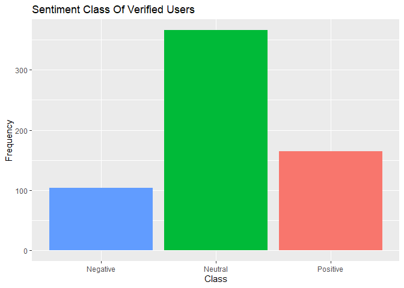<!-- -->

\

## Unverified Users


```r
unverified_tweets <- testdata[testdata$user_verified == 'False', c('user_verified','text')]
head(unverified_tweets)
```

```
##   user_verified
## 1         False
## 2         False
## 3         False
## 5         False
## 6         False
## 7         False
##                                                                                                                                             text
## 1                                              Same folks said daikon paste could treat a cytokine storm #PfizerBioNTech https://t.co/xeHhIMg1kF
## 2 While the world has been on the wrong side of history this year, hopefully, the biggest vaccination effort we've evâ\200¦ https://t.co/dlCHrZjkhm
## 3 #coronavirus #SputnikV #AstraZeneca #PfizerBioNTech #Moderna #Covid_19 Russian vaccine is created to last 2-4 yearsâ\200¦ https://t.co/ieYlCKBr8P
## 5      Explain to me again why we need a vaccine @BorisJohnson @MattHancock #whereareallthesickpeople #PfizerBioNTechâ\200¦ https://t.co/KxbSRoBEHq
## 6             Does anyone have any useful advice/guidance for whether the COVID vaccine is safe whilst breastfeeding?â\200¦ https://t.co/EifsyQoeKN
## 7  it is a bit sad to claim the fame for success of #vaccination on patriotic competition between USA, Canada, UK andâ\200¦ https://t.co/IfMrAyGyTP
```


```r
unverified_sentiment = get_nrc_sentiment(unverified_tweets$text)

unverified_sentiment_score<-data.frame(colSums(unverified_sentiment[,]))
names(unverified_sentiment_score)<-"Score"
unverified_sentiment_score<-cbind("sentiment"=rownames(unverified_sentiment_score),unverified_sentiment_score)
rownames(unverified_sentiment_score)<-NULL

unverified_sentiment_score
```

```
##       sentiment Score
## 1         anger   754
## 2  anticipation  1492
## 3       disgust   485
## 4          fear  1134
## 5           joy  1079
## 6       sadness   925
## 7      surprise   853
## 8         trust  1806
## 9      negative  1662
## 10     positive  5116
```


```r
#plotting the sentiments with scores
ggplot(data=unverified_sentiment_score,aes(x=sentiment,y=Score))+geom_bar(aes(fill=sentiment),stat = "identity")+
  theme(legend.position="none")+
  xlab("Sentiments")+ylab("scores")+ggtitle("Sentiments of Unverified Users ")
```

<!-- -->


```r
unverified_tokens = get_sentences(unverified_tweets$text)
unverified_sent = get_sentiment(unverified_tokens, method = "afinn")
head(unverified_sent)
```

```
## [1] 0 0 0 0 3 1
```


```r
(table(sent))
```

```
## sent
##   -9   -8   -7   -6   -5   -4   -3   -2   -1    0    1    2    3    4    5    6 
##    2    3    7   19   29   95  163  388  313 2237  341  664  344  135  125   63 
##    7    8    9   10   11 
##   36   18    8    8    2
```


```r
unverified_numeric_sentiment = data.frame(table(unverified_sent))
names(unverified_numeric_sentiment) = c("Score","Frequency")
unverified_numeric_sentiment
```

```
##    Score Frequency
## 1     -9         2
## 2     -7         5
## 3     -6        22
## 4     -5        30
## 5     -4        78
## 6     -3       173
## 7     -2       421
## 8     -1       323
## 9      0      4377
## 10     1       372
## 11     2       870
## 12     3       433
## 13     4       150
## 14     5        98
## 15     6        47
## 16     7        16
## 17     8        12
## 18     9         5
## 19    10         4
## 20    11         1
```


```r
ggplot(data=unverified_numeric_sentiment,aes(x=Score,y=Frequency))+geom_bar(aes(fill=rainbow(nrow(unverified_numeric_sentiment))), stat='identity')+
  theme(legend.position="none")+
  xlab("Sentiments")+ylab("scores")+ggtitle("Sentiments Score Of Unverified Users ")
```

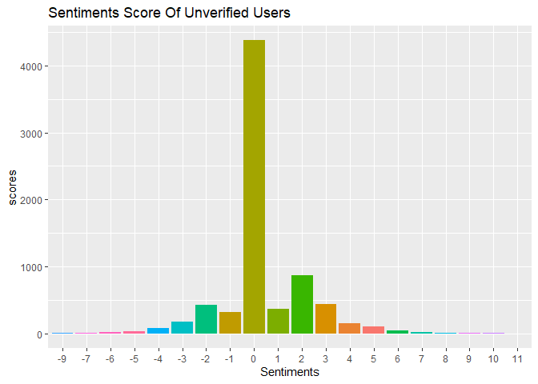<!-- -->


```r
unverified_neg <- unverified_numeric_sentiment[1:8,]
unverified_neg <- sum(unverified_neg$Frequency)
unverified_neg
```

```
## [1] 1054
```

```r
unverified_neu <- unverified_numeric_sentiment[9,]
unverified_neu <- sum(unverified_neu$Frequency)
unverified_neu
```

```
## [1] 4377
```

```r
unverified_pos <- unverified_numeric_sentiment[10:19,]
unverified_pos <- sum(unverified_pos$Frequency)
unverified_pos
```

```
## [1] 2007
```


```r
unverified_sentiment_class = data.frame(
  'Class'= c('Negative', 'Neutral', 'Positive'), 
  'Frequency'= c(unverified_neg,unverified_neu,unverified_pos))

head(unverified_sentiment_class)
```

```
##      Class Frequency
## 1 Negative      1054
## 2  Neutral      4377
## 3 Positive      2007
```


```r
ggplot(data=unverified_sentiment_class,aes(x=Class,y=Frequency))+geom_bar(aes(fill=rainbow(nrow(unverified_sentiment_class))), stat='identity')+
  theme(legend.position="none")+ggtitle("Sentiment Class Of Unverified Users")
```

<!-- -->

